# Cinematica - Kubernetes Deployment Guide

A step-by-step guide to containerize and deploy the Cinematica MERN application to Kubernetes.

---

## Table of Contents

1. [Containerize the MERN App](#1-containerize-the-mern-app)
2. [Build Multi-Architecture Images](#2-build-multi-architecture-images)
3. [Deploy to Kubernetes](#3-deploy-to-kubernetes)
4. [Access the Application](#4-access-the-application)

---

## 1. Containerize the MERN App

### Docker Compose Configuration

Create `docker-compose.yml` in the project root:

```yaml
services:
  db:
    image: mongo:latest
    container_name: cinematica-mongodb
    ports:
      - "27017:27017"
    volumes:
      - mongo_data:/data/db
    environment:
      MONGO_INITDB_DATABASE: cinematica
    networks:
      - cinematica-network
    healthcheck:
      test: ["CMD", "mongosh", "--quiet", "--eval", "db.adminCommand('ping').ok"]
      interval: 10s
      timeout: 5s
      retries: 5

  server:
    build: ./server
    image: karimshahid/cinematica-server:latest
    container_name: cinematica-server
    env_file:
      - ./server/.env
    ports:
      - 5001:5001
    restart: unless-stopped
    depends_on: 
      db:
        condition: service_healthy
    networks:
      - cinematica-network

  client:
    build: 
      context: ./client
    image: karimshahid/cinematica-client:latest
    container_name: cinematica-client
    ports:
      - 80:80
    restart: unless-stopped 
    depends_on:
      - server
    networks:
      - cinematica-network

networks:
  cinematica-network:
    driver: bridge

volumes:
  mongo_data:
```

**Test locally:**
```bash
docker-compose up --build
```

---

## 2. Build Multi-Architecture Images

Build images that support both AMD64 (Intel/AMD) and ARM64 (Apple Silicon) architectures.

### Setup Buildx

```bash
docker buildx create --use
```

### Build and Push Server Image

```bash
docker buildx build \
  --platform linux/amd64,linux/arm64 \
  -t karimshahid/cinematica-server:latest \
  ./server \
  --push
```

### Build and Push Client Image

```bash
docker buildx build \
  --platform linux/amd64,linux/arm64 \
  -t karimshahid/cinematica-client:latest \
  ./client \
  --push
```

**Verify images on Docker Hub:**
- Check that both `amd64` and `arm64` manifests are present

---

## 3. Deploy to Kubernetes

### Prerequisites

**Start Minikube:**
```bash
minikube start
```

**Enable Ingress Addon:**
```bash
minikube addons enable ingress
```

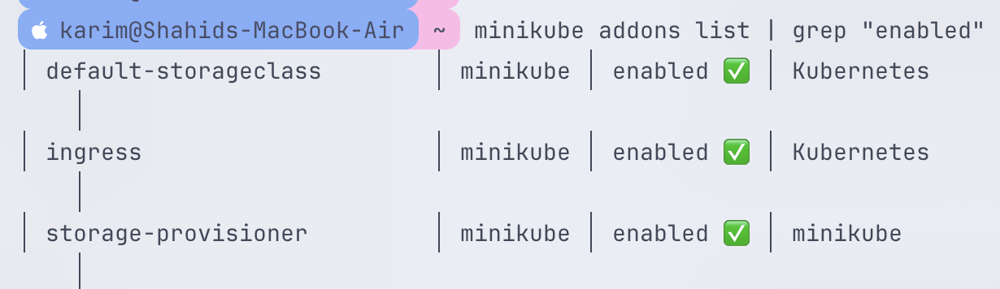

This creates the Nginx ingress controller in the `ingress-nginx` namespace:

```
Namespace: ingress-nginx
     ↓
Deployment: ingress-nginx-controller
     ↓
Pod: ingress-nginx-controller-xxxxx
```

**Verify ingress controller is running:**
```bash
kubectl get pods -n ingress-nginx
```

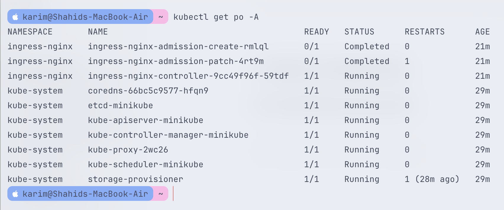

---

### Deploy MongoDB (Database Layer)

MongoDB requires persistent storage to retain data across pod restarts.

#### Create PersistentVolumeClaim

**`mongodb-pvc.yaml`:**
```yaml
apiVersion: v1
kind: PersistentVolumeClaim
metadata:
  name: mongodb-pvc
spec:
  accessModes:
    - ReadWriteOnce
  resources:
    requests:
      storage: 1Gi
```

```bash
kubectl apply -f mongodb-pvc.yaml
kubectl get pvc
```

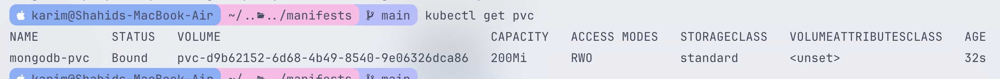

**Expected:** Status should show `Bound`

#### Create MongoDB Deployment

**`mongodb-deployment.yaml`:**
```yaml
apiVersion: apps/v1
kind: Deployment
metadata:
  name: cinematica-mongodb-deployment
  labels:
    app: cinematica-mongodb
spec:
  replicas: 1
  selector:
    matchLabels:
      app: cinematica-mongodb
  template:
    metadata:
      labels:
        app: cinematica-mongodb
    spec:
      containers:
        - name: cinematica-mongodb
          image: mongo:latest
          ports:
            - containerPort: 27017
          env: 
            - name: MONGO_INITDB_DATABASE
              value: "cinematica"
          resources:
            requests:
              memory: "256Mi"
              cpu: "100m"
            limits:
              memory: "512Mi"
              cpu: "500m"
          volumeMounts:
            - name: mongo-data
              mountPath: /data/db
      volumes:
        - name: mongo-data
          persistentVolumeClaim:
            claimName: mongodb-pvc
```

```bash
kubectl apply -f mongodb-deployment.yaml
kubectl get pods -l app=cinematica-mongodb
```

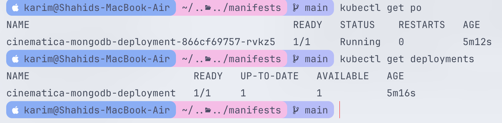

**⚠️ Important:** MongoDB uses `replicas: 1` because:
- MongoDB is **stateful**, not stateless
- Without a replica set configuration, multiple pods would create **independent databases**
- This could cause **data inconsistency** and **corruption**
- Each pod would have its own data in `/data/db`

#### Create MongoDB Service

**`mongodb-service.yaml`:**
```yaml
apiVersion: v1
kind: Service
metadata:
  name: cinematica-mongodb-service
  labels:
    app: cinematica-mongodb
spec:
  selector:
    app: cinematica-mongodb
  ports:
    - port: 27017
      targetPort: 27017
  type: ClusterIP
```

```bash
kubectl apply -f mongodb-service.yaml
kubectl get svc cinematica-mongodb-service
```

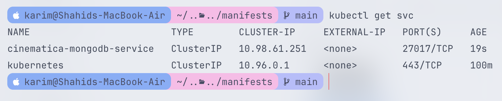

---

### Deploy Backend (API Layer)

#### Create Secrets

**Encode your credentials:**
```bash
echo -n 'your-tmdb-api-key' | base64
echo -n 'your-jwt-secret' | base64
echo -n 'your-refresh-secret' | base64
```

**`backend-secret.yaml`:**
```yaml
apiVersion: v1
kind: Secret
metadata:
  name: cinematica-secret
type: Opaque
data:
  TMDB_API_KEY: <base64-encoded-value>
  JWT_SECRET: <base64-encoded-value>
  REFRESH_SECRET: <base64-encoded-value>
```

**⚠️ Critical:** Must be `TMDB_API_KEY`, not `IMDB_API_KEY`!

```bash
kubectl apply -f backend-secret.yaml
kubectl get secrets
```

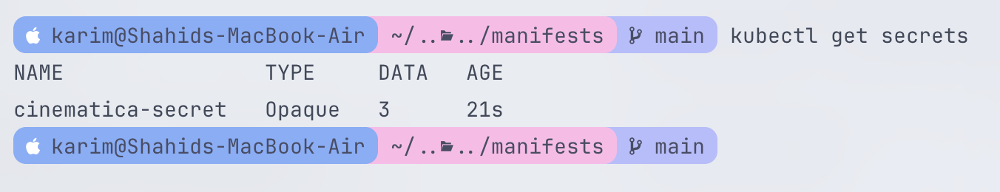

#### Create Backend Deployment

**`backend-deployment.yaml`:**
```yaml
apiVersion: apps/v1
kind: Deployment
metadata:
  name: cinematica-backend-deployment
  labels:
    app: cinematica-backend
spec:
  replicas: 2
  selector:
    matchLabels:
      app: cinematica-backend
  template:
    metadata:
      labels:
        app: cinematica-backend
    spec:
      containers:
        - name: cinematica-backend
          image: karimshahid/cinematica-server:latest
          ports:
            - containerPort: 5001
          env:
            - name: PORT
              value: "5001"
            - name: MONGODB_URI
              value: "mongodb://cinematica-mongodb-service:27017/cinematica"
          envFrom:
            - secretRef:
                name: cinematica-secret
          resources:
            requests:
              memory: "128Mi"
              cpu: "100m"
            limits:
              memory: "256Mi"
              cpu: "500m"
```

```bash
kubectl apply -f backend-deployment.yaml
```

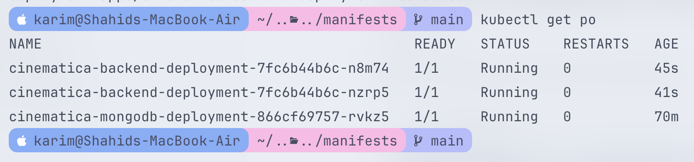

**Verify backend is running and connected to MongoDB:**
```bash
kubectl logs -l app=cinematica-backend
```

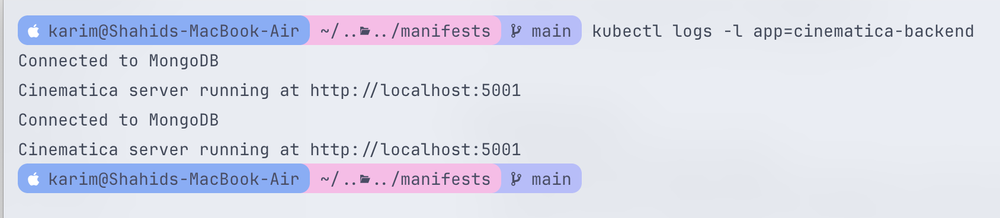

**Expected output:**
```
Connected to MongoDB
Cinematica server running at http://localhost:5001
```

**If needed, restart deployment:**
```bash
kubectl rollout restart deployment cinematica-backend-deployment
```

#### Create Backend Service

**`backend-service.yaml`:**
```yaml
apiVersion: v1
kind: Service
metadata:
  name: cinematica-backend-service
  labels:
    app: cinematica-backend
spec:
  selector:
    app: cinematica-backend
  ports:
    - port: 5001
      targetPort: 5001
  type: ClusterIP
```

```bash
kubectl apply -f backend-service.yaml
kubectl get svc cinematica-backend-service
```

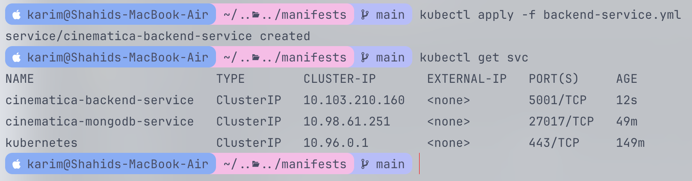

---

### Deploy Frontend (Presentation Layer)

#### Update nginx Configuration

**Before deploying, ensure `client/nginx.conf` has the correct backend service name:**

```nginx
location /api {
  proxy_pass http://cinematica-backend-service:5001;
  proxy_http_version 1.1;
  proxy_set_header Host $host;
  proxy_set_header X-Real-IP $remote_addr;
}
```

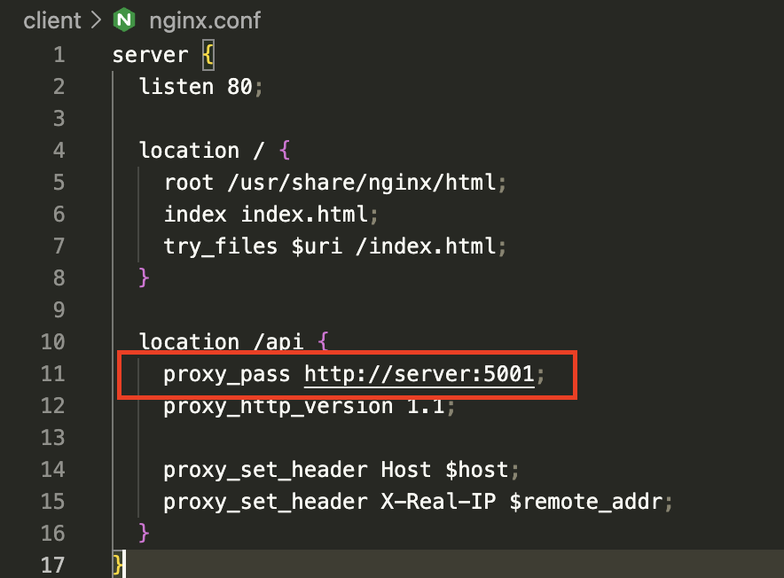

**If you used `http://server:5001` during Docker development, you must change it to `cinematica-backend-service` for Kubernetes.**

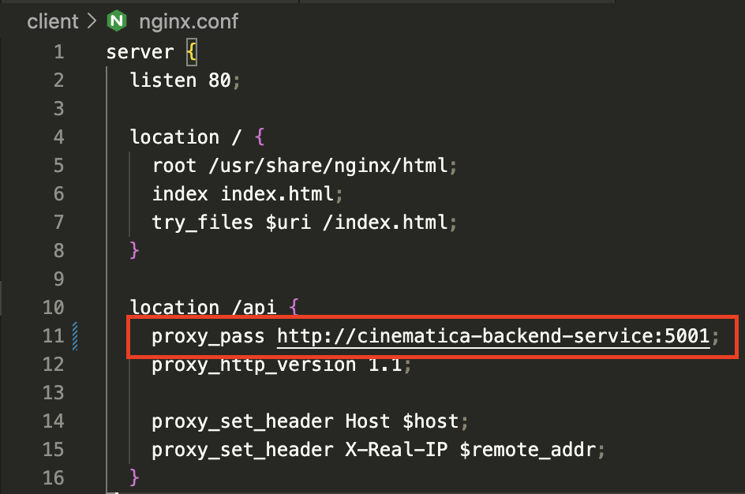

**Rebuild and push the updated image:**
```bash
docker buildx build \
  --platform linux/amd64,linux/arm64 \
  -t karimshahid/cinematica-client:latest \
  ./client \
  --push
```

#### Create Frontend Deployment

**`frontend-deployment.yaml`:**
```yaml
apiVersion: apps/v1
kind: Deployment
metadata:
  name: cinematica-frontend-deployment
  labels:
    app: cinematica-frontend
spec:
  replicas: 2
  selector:
    matchLabels:
      app: cinematica-frontend
  template:
    metadata:
      labels:
        app: cinematica-frontend
    spec:
      containers:
        - name: cinematica-frontend
          image: karimshahid/cinematica-client:latest
          ports:
            - containerPort: 80
          resources:
            requests:
              memory: "64Mi"
              cpu: "50m"
            limits:
              memory: "128Mi"
              cpu: "200m"
```

```bash
kubectl apply -f frontend-deployment.yaml
```

**If you updated the nginx config, restart the deployment:**
```bash
kubectl rollout restart deployment cinematica-frontend-deployment
```

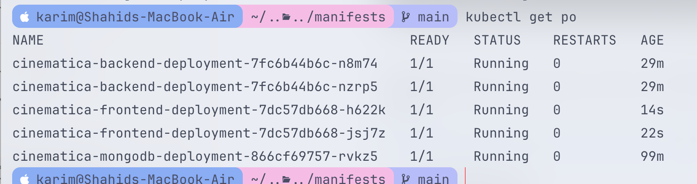

#### Create Frontend Service

**`frontend-service.yaml`:**
```yaml
apiVersion: v1
kind: Service
metadata:
  name: cinematica-frontend-service
  labels:
    app: cinematica-frontend
spec:
  selector:
    app: cinematica-frontend
  ports:
    - port: 80
      targetPort: 80
  type: ClusterIP
```

```bash
kubectl apply -f frontend-service.yaml
kubectl get svc cinematica-frontend-service
```

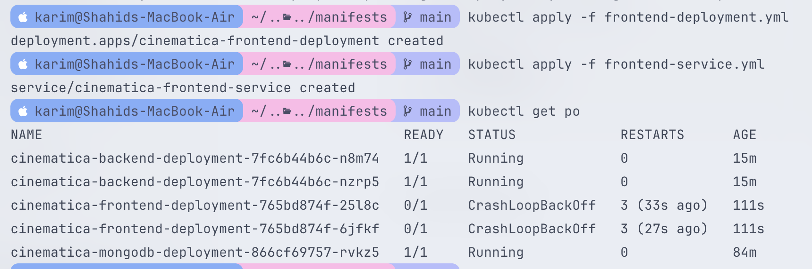

**Optional - Test with minikube service:**
```bash
minikube service cinematica-frontend-service
```

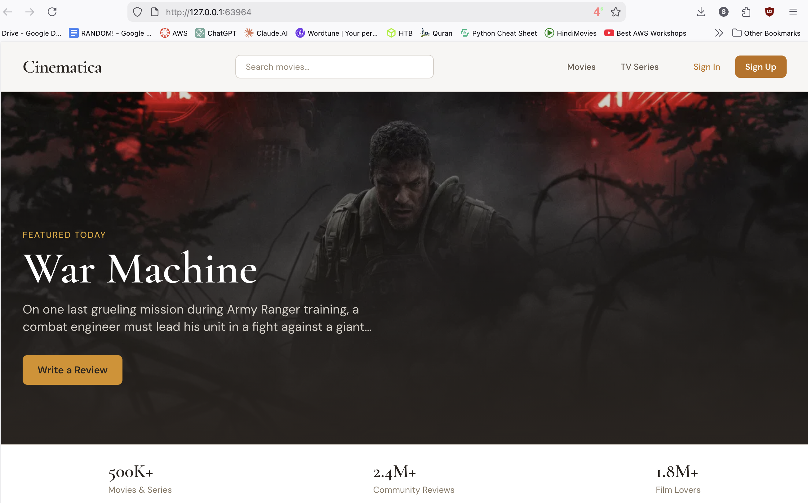

---

### Configure Ingress (External Access)

#### Verify Ingress Controller

```bash
kubectl get pods -n ingress-nginx
```

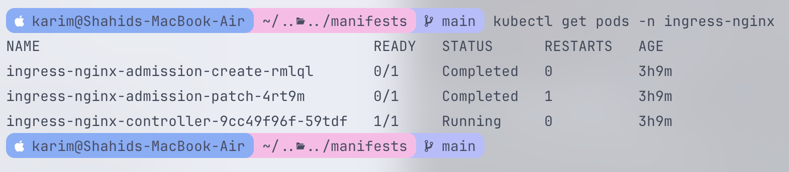

**Expected:** Pod should be in `Running` state

#### Create Ingress Resource

**`ingress.yaml`:**
```yaml
apiVersion: networking.k8s.io/v1
kind: Ingress
metadata:
  name: cinematica-ingress
spec:
  ingressClassName: nginx
  rules:
    - http:
        paths:
          - path: /
            pathType: Prefix
            backend:
              service:
                name: cinematica-frontend-service
                port:
                  number: 80
```

```bash
kubectl apply -f ingress.yaml
kubectl get ingress
```

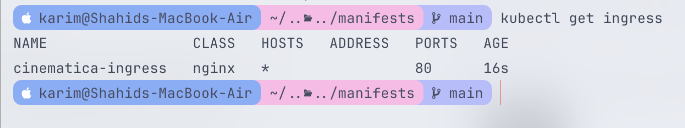

**Expected output:**
```
NAME                 CLASS   HOSTS   ADDRESS         PORTS   AGE
cinematica-ingress   nginx   *       192.168.49.2    80      1m
```

---

## 4. Access the Application

### Method 1: Minikube Tunnel (Recommended)

**Start tunnel (keep running in a separate terminal):**
```bash
sudo minikube tunnel
```

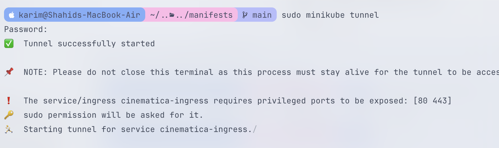

**Access the application:**
- Open browser: `http://localhost`
- Or: `http://127.0.0.1`

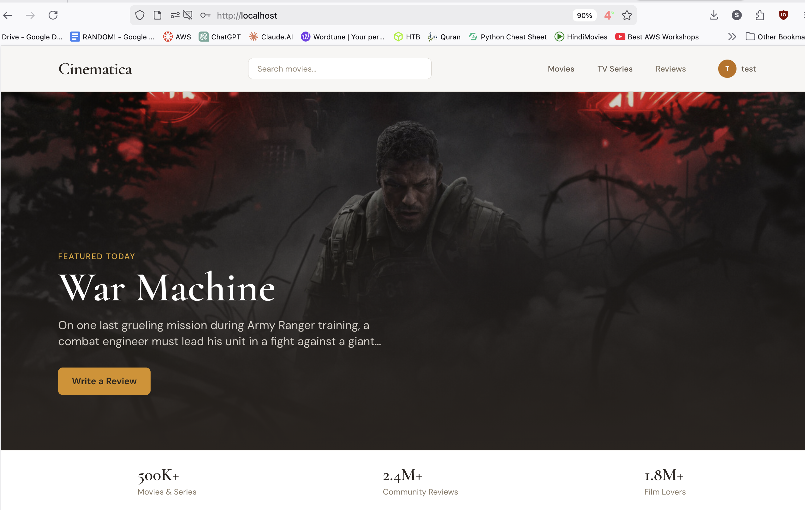

### Method 2: Minikube Service (Without Ingress)

```bash
minikube service cinematica-frontend-service
```

This opens the application in your default browser with a NodePort URL.

### Method 3: Port Forwarding (For Testing)

```bash
# Frontend
kubectl port-forward svc/cinematica-frontend-service 8080:80

# Backend
kubectl port-forward svc/cinematica-backend-service 5001:5001
```

Access at `http://localhost:8080` or `http://localhost:5001`

---

## Verification Checklist

**Check all pods are running:**
```bash
kubectl get pods
```

**Expected output:**
```
NAME                                              READY   STATUS    RESTARTS
cinematica-mongodb-deployment-xxxxx               1/1     Running   0
cinematica-backend-deployment-xxxxx-xxxxx         1/1     Running   0
cinematica-backend-deployment-xxxxx-xxxxx         1/1     Running   0
cinematica-frontend-deployment-xxxxx-xxxxx        1/1     Running   0
cinematica-frontend-deployment-xxxxx-xxxxx        1/1     Running   0
```

**Check all services:**
```bash
kubectl get svc
```

**Expected output:**
```
NAME                            TYPE        CLUSTER-IP      PORT(S)
cinematica-mongodb-service      ClusterIP   10.x.x.x        27017/TCP
cinematica-backend-service      ClusterIP   10.x.x.x        5001/TCP
cinematica-frontend-service     ClusterIP   10.x.x.x        80/TCP
```

**Check ingress:**
```bash
kubectl get ingress
```

**Test the application:**
1. Open `http://localhost` in browser
2. Sign up for a new account
3. Browse movies and TV shows
4. Write a review
5. Verify data persists after pod restarts

---

## Common Issues and Solutions

### Movies Not Loading

**Problem:** Frontend loads but movies don't appear.

**Check backend logs:**
```bash
kubectl logs -l app=cinematica-backend
```

**Verify TMDB API key:**
```bash
kubectl exec -it <backend-pod-name> -- env | grep TMDB
```

**Solution:** Ensure Secret has `TMDB_API_KEY` (not `IMDB_API_KEY`). If wrong:
```bash
kubectl delete secret cinematica-secret
kubectl apply -f backend-secret.yaml
kubectl rollout restart deployment cinematica-backend-deployment
```

### Backend Can't Connect to MongoDB

**Verify environment variable:**
```bash
kubectl exec -it <backend-pod-name> -- env | grep MONGODB
```

**Should show:**
```
MONGODB_URI=mongodb://cinematica-mongodb-service:27017/cinematica
```

### Frontend API Calls Failing

**Check nginx configuration inside pod:**
```bash
kubectl exec -it <frontend-pod-name> -- cat /etc/nginx/conf.d/default.conf
```

**Should show:**
```nginx
proxy_pass http://cinematica-backend-service:5001;
```

**If it shows `http://server:5001`:**
1. Update `client/nginx.conf` with correct service name
2. Rebuild and push image
3. Restart deployment

---

## Clean Up

**Delete all resources:**
```bash
kubectl delete -f ingress.yaml
kubectl delete -f frontend-service.yaml
kubectl delete -f frontend-deployment.yaml
kubectl delete -f backend-service.yaml
kubectl delete -f backend-deployment.yaml
kubectl delete -f backend-secret.yaml
kubectl delete -f mongodb-service.yaml
kubectl delete -f mongodb-deployment.yaml
kubectl delete -f mongodb-pvc.yaml
```

**Or delete by label (if you labeled all resources):**
```bash
kubectl delete all -l app=cinematica
```

**Stop Minikube:**
```bash
minikube stop
```

---

## Summary

You've successfully:
✅ Containerized a full-stack MERN application  
✅ Built multi-architecture Docker images  
✅ Deployed MongoDB with persistent storage  
✅ Deployed a scalable backend API with Secrets  
✅ Deployed a scalable frontend with nginx  
✅ Configured Ingress for external access  
✅ Implemented service discovery and pod-to-pod communication  

**Next Steps:**
- Implement Horizontal Pod Autoscaler (HPA)
- Add monitoring with Prometheus/Grafana
- Configure TLS/SSL certificates
- Set up CI/CD pipeline for automated deployments

---

**Happy Deploying! ☸️**
